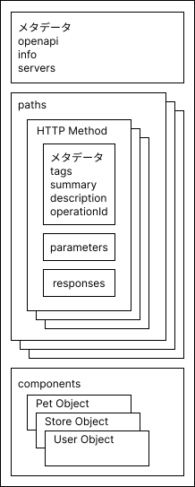
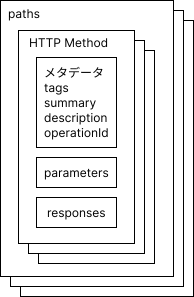
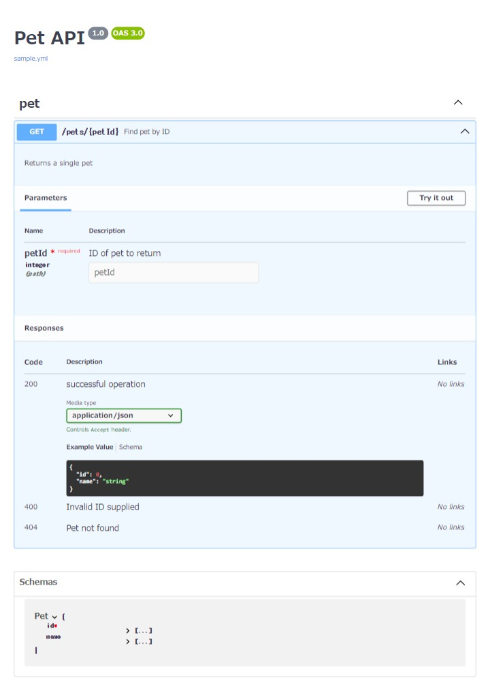

# OpenAPIを使ってみる

- [OpenAPIを使ってみる](#openapiを使ってみる)
  - [OpenAPIのサンプル](#openapiのサンプル)
  - [OpenAPI仕様の概要](#openapi仕様の概要)
  - [OpenAPIが扱えるデータ型](#openapiが扱えるデータ型)
  - [`paths`セクション](#pathsセクション)
  - [`components`セクション](#componentsセクション)
    - [`schemas`](#schemas)
    - [`securitySchemes`](#securityschemes)
  - [まとめ](#まとめ)
  - [OpenAPI仕様書を可視化する](#openapi仕様書を可視化する)

このセクションではOpenAPIの基礎を学び、次の状態を目指します。
- OpenAPIの登場人物がわかる
- OpenAPI仕様を読める
- OpenAPI仕様を書ける
- OpenAPIの公式ドキュメントを参照できる

## OpenAPIのサンプル
次のような仕様のAPIを考えます。
1. IDを指定して、特定のペットの情報を取得
1. IDが未指定の場合、HTTP400を返却
1. 存在しないIDの場合、HTTP404を返却
1. エンドポイントは次の通り：`/pets/1`
   
この仕様をOpenAPI仕様で定義すると以下のようになります。
```yml
openapi: 3.0.2
info:
  title: Pet API
  version: '1.0.0'
servers:
  - url: https://dev.sample-server.com/v1
    description: Development server
  - url: https://stg.sample-server.com/v1
    description: Staging server
  - url: https://api.sample-server.com/v1
    description: Production server
paths:
  /pets/{petId}:
    get:
      tags:
        - pet
      summary: Find pet by ID
      description: Returns a single pet
      operationId: getPetById
      parameters:
        - in: path
          name: petId
          required: true
          schema:
            type: integer
          description: ID of pet to return
      responses:
        '200':
          description: successful operation
          content:
            application/json:
              schema:
                $ref: '#/components/schemas/Pet'
        '400':
          description: Invalid ID supplied
        '404':
          description: Pet not found
components:
  schemas:
    Pet:
      type: object
      required:
        - id
      properties:
        id:
          type: integer
        name:
          type: string
```

サンプルのOpenAPI仕様の説明です。[]で括られた key はプレースホルダー、value は key の説明です。
```yml
openapi: OpenAPI仕様バージョン
info:
  title: API名称
  version: APIドキュメントバージョン
servers:
  - url: APIのベースURL
    description: APIサーバーの説明
paths:
  [エンドポイントパス]:
    [HTTPメソッド]:
      tags:
        - 紐づけるタグ
      summary: エンドポイント概要
      description: エンドポイント説明
      operationId: エンドポイントID
      parameters:
        - in: path|query|header|cookie
          name: パラメータ名称
          required: true|false
          schema:
            type: データ型
          description: パラメータ説明
      responses:
        [HTTPステータスコード]:
          description: レスポンス説明
          content:
            [Content-type]:
              schema:
                $ref: 参照先コンポーネントパス
components:
  [再利用可能なオブジェクトの種類]:
    [オブジェクトにマッピングされるコンポーネント名]:
      type: データ型
      required:
        - 必須プロパティ
      properties:
        [プロパティ名]:
          type: データ型
```

## OpenAPI仕様の概要
以下の公開されている`Swagger Editor`にアクセスすると、OpenAPI仕様の全体像がわかります。  
ドキュメント: [Swagger Editor](https://editor.swagger.io/)

`Swagger Editor`のOpenAPI仕様を図示します。
枠の重なりは、同じ構造の繰り返しを意味します。



図で捉えると、大きく2分割できます
- `paths`セクション: API仕様を定義。
- `components`セクション: コンポーネント化された定義を`paths`セクションで参照。定義をコンポーネント化することで、一貫性を保てます。


各セクションを解説する前に、OpenAPIが扱えるデータ型を紹介します。

## OpenAPIが扱えるデータ型
|型|フォーマット|説明|
|--|--|--|
|integer|int32|符号付32bits|
|integer|int64|符号付64bits|
|number|float||
|number|double||
|string|||
|boolean|||
|object|||
|array|||

上記の型を使用してAPI仕様を定義します。  
ドキュメント: [Data Type](https://spec.openapis.org/oas/latest.html#data-types)

## `paths`セクション
API仕様を定義するセクションです。

図解した`paths`セクションを再度添付します。



サンプルのOpenAPI仕様を元に説明します。[]で括られた key はプレースホルダー、value は key の説明です。
```yml
paths:
  [エンドポイントパス]:
    [HTTPメソッド]:
      tags:
        - 紐づけるタグ
      summary: エンドポイント概要
      description: エンドポイント説明
      operationId: エンドポイントID
      parameters:
        - in: path|query|header|cookie
          name: パラメータ名称
          required: true|false
          schema:
            type: データ型
          description: パラメータ説明
      responses:
        [HTTPステータスコード]:
          description: レスポンス説明
          content:
            [Content-type]:
              schema:
                $ref: 参照先コンポーネントパス
```

捕捉:
- `parameters`: パス、クエリパラメータ、HTTPヘッダーなどから受け取るパラメータを定義。
  - `in`
    - `path`: `/pets/{petId}`のように波括弧で括った部分のパスパラメータを定義。
    - `query`: `/pets?category=xxx`のようにクエリパラメータを定義。
    - `header `: 期待するカスタムヘッダー。ヘッダー名は大文字小文字を区別しないルールとなっています。
    - `cookie`: APIに特定の`cookie`値を渡すための設定。
- `requestBody`: リクエストボディからパラメータを受け取る場合に、以下のような形式で定義。

    ```yml
    requestBody:
      description: Update an existent pet in the store
      content:
        application/json:
          schema:
            $ref: '#/components/schemas/Pet'
      required: true
    ```

ドキュメント: [Paths Object](https://spec.openapis.org/oas/latest.html#paths-object)

## `components`セクション
API定義をコンポーネント化し、再利用することで一貫性を保ち、効率的にAPI仕様を定義できます。  
以下のように、様々な種類のAPI定義をコンポーネント化できます。  
使用頻度の高そうな、`schemas`、`securitySchemes`について説明します。

```yml
components:
  schemas:
  responses:
  parameters:
  examples:
  requestBodies:
  headers:
  securitySchemes:
  links:
  callbacks:
  pathItems:
```

### `schemas`
以下は、注文スキーマを定義しています。  
スキーマ自体のデータ型を指定し、各プロパティのデータ型とサンプル値を定義しています。  
注文スキーマを定義することで、注文に関する各エンドポイントのパラメータやレスポンス形式の定義で使い回すことができます。

```yml
schemas:
  Order:
    type: object
    properties:
      id:
        type: integer
        format: int64
        example: 10
      petId:
        type: integer
        format: int64
        example: 198772
      quantity:
        type: integer
        format: int32
        example: 7
      shipDate:
        type: string
        format: date-time
      status:
        type: string
        description: Order Status
        example: approved
        enum:
          - placed
          - approved
          - delivered
      complete:
        type: boolean
```

ドキュメント: [Schema Object](https://spec.openapis.org/oas/latest.html#schema-object)

### `securitySchemes`
APIの認証方式の定義をコンポーネント化します。  
以下のような様々な認証方式をサポートしています。

- Basic認証
- API Key認証
- JWT Bearer認証
- OAuth2.0
- OpenIDConnect

```yml
components:
  securitySchemes:
    jwt:
      type: http
      scheme: bearer
      bearerFormat: JWT
      description: JWT認証
    ApiKeyAuth:
      type: apiKey
      in: header
      name: X-API-KEY
      description: API KEY認証
```

ドキュメント: [Security Scheme Object](https://spec.openapis.org/oas/latest.html#securitySchemeObject)

## まとめ
- OpenAPI仕様は `JSON` または `YAML` 形式で記述。  
- `paths`で各エンドポイントの仕様を定義。
- `components`でAPI仕様をコンポーネント化し、再利用することで一貫性を保ち、効率的にAPI設計できる。

## OpenAPI仕様書を可視化する
`Swagger UI`を使用して、コードベースの `JSON` や `YAML` 形式の仕様書からHTMLを生成しWeb上で閲覧できるようにします。  

`Swagger UI`とは「OpenAPI Specificatioinに従って記述されたAPI仕様書をWebページ上で見やすく表示するツール」です。  
`Swagger Editor`, `Swagger Codegen` とともによく使われるツールになります。


1. プロジェクトフォルダに移動し、次のコマンドを実行して`swagger-ui`をインストールします。
    ```sh
    npm install swagger-ui-dist
    ```
1. プロジェクトのルートにOpenAPI仕様書の`yaml`ファイルを作成し、APIの定義を記述します。ファイル名は`sample.yml`とします。
1. `index.html`ファイルを作成し、次のコードを記述します。   
    `SwaggerUIBundle`に渡されるオプション `url` を書き換えることで初期表示を切り替えることができます。

    ```html
    <!DOCTYPE html>
    <html>
    <head>
      <title>Sampla API</title>
      <link rel="stylesheet" type="text/css" href="node_modules/swagger-ui-dist/swagger-ui.css">
      <link rel="icon" type="image/png" href="node_modules/swagger-ui-dist/favicon-32x32.png" sizes="32x32">
      <link rel="icon" type="image/png" href="node_modules/swagger-ui-dist/favicon-16x16.png" sizes="16x16">
    </head>
    <body>
      <div id="swagger-ui"></div>
      <script src="node_modules/swagger-ui-dist/swagger-ui-bundle.js"></script>
      <script src="node_modules/swagger-ui-dist/swagger-ui-standalone-preset.js"></script>
      <script>
        window.onload = function() {
          window.ui = SwaggerUIBundle({
            url: 'sample.yml',
            dom_id: '#swagger-ui',
            deepLinking: true,
            presets: [
              SwaggerUIBundle.presets.apis,
              SwaggerUIStandalonePreset
            ],
            plugins: [
              SwaggerUIBundle.plugins.DownloadUrl
            ],
            layout: 'BaseLayout',
            // layout: 'StandaloneLayout',

            // Schemasセクションを非表示。
            // defaultModelsExpandDepth: -1,

            // 認証情報をブラウザに記憶。
            // persistAuthorization: true,

            // 試行（Try it outボタン）を許可するHTTPメソッド。空の配列を設定するとすべての操作の試行が無効になります。
            // supportedSubmitMethods: [],
            // supportedSubmitMethods: ['get', 'put', 'post', 'delete', 'options', 'head', 'patch', 'trace'],
          });
        }
      </script>
    </body>
    </html>
    ```
1. ブラウザで`index.html`を開くと、`Swagger UI`が呼び出されOpenAPI仕様書が表示されます。

    

    実際のサンプルはこちらで確認できます。  
    [https://takuya-motoshima.github.io/learn-open-api/](https://takuya-motoshima.github.io/learn-open-api/)

